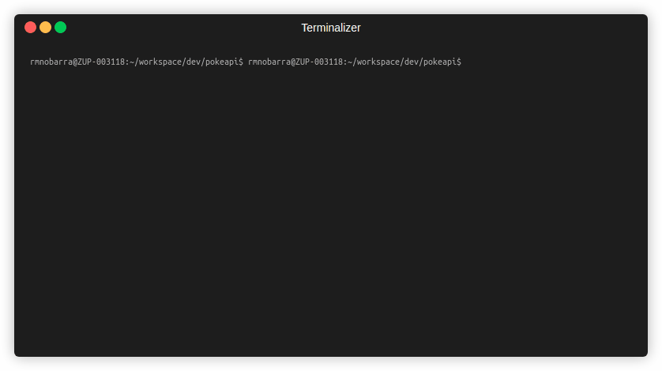

# Pokedex

## Desafio:

Crie um código, pode ser na linguagem de sua preferência:

Consumir a API restfull: https://pokeapi.co/

Retornar os dez primeiros Pokémon, ordenado por habilidade. 

O Resultado deve exibir:

- nome
- habilidade
- tipo

Deve ser possível informar um nome do pokemon para consulta, e o resultado deve trazer os campos:

- nome
- habilidade
- tipo

É necessário informar o usuário caso o pokemon informado não for encontrado.

O resultado deve ser armazendo em um arquivo csv.

## Solução:

Se o nome do Pokemon for fornecido, o código obterá as informações do Pokemon usando a função get_pokemon_info. Essa função faz uma solicitação à API usando o nome do Pokemon e retorna o nome, habilidade e tipo do Pokemon se a resposta for bem-sucedida. As informações do Pokemon serão escritas em um arquivo CSV.

Se o nome do Pokemon não for fornecido, o código obterá as informações dos primeiros 10 Pokemons e os classificará por habilidade. As informações dos Pokemons serão escritas em um arquivo CSV.

Em ambos os casos, se as informações do Pokemon não forem encontradas, o código informará o usuário.

## Exemplo

